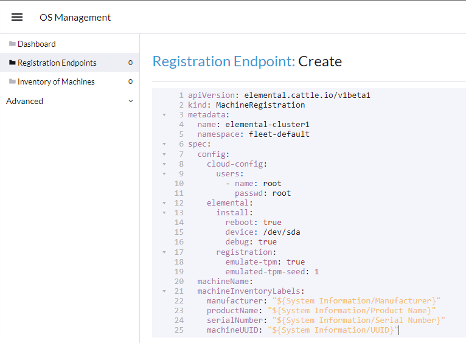

import Cluster from "!!raw-loader!@site/examples/quickstart/cluster.yaml"
import Registration from "!!raw-loader!@site/examples/quickstart/registration.yaml"
import RegistrationRPi from "!!raw-loader!@site/examples/quickstart/rpi-registration.yaml"
import Selector from "!!raw-loader!@site/examples/quickstart/selector.yaml"
import Prereqs from './partials/_quickstart-prereqs.md'
import Operator from './partials/_elemental-operator-install.md'

# Elemental the visual way

This quickstart will show you how to deploy the Elemental plugin into an existing Rancher Manager instance.

Once installed, you'll be able to provision a new Elemental cluster based on RKE2 or K3s.

<Prereqs />

<Operator />

## Enable the Rancher Manager Extensions Support

In order to enable the Rancher Manager Extensions Support, you'll need to follow the steps below:

* Open a web browser, connect and login to your Rancher Manager instance
* Click on the top left menu `a` and click on `Extensions`


* Click on `Enable` button to install the `Extension Operator`


* A popup will appear, click on the `OK` button to continue and install the Rancher Manager Extensions repository


[next section](#install-the-elemental-plugin)

## Install the elemental plugin

After the Rancher Manager Extensions Support is enabled, you can install the `elemental` plugin as follow:

* Under the `Available` tab you will see `elemental` plugin available


:::note
If the `Available` tab shows no entries, refresh the page. The `elemental` plugin will then appear.
:::

* Click on the `Install` button, a popup will appear and click on `Install` again to continue.


* On the `Installed` tab, the `elemental` plugin is now listed.

:::note
If the `elemental` plugin is listed and the status stays at `Installing...`, refresh the page. The `elemental` plugin will display correctly.
:::

Once the `elemental` plugin installed, you can see the `OS Manamagent` option in the Rancher Manager menu.


## Add a Machine Registration Endpoint

In the OS Management dashboard, click the `Create Registration Endpoint` button.


Now here either you can enter each detail in its respective places or you can edit this as YAML and create the endpoint in one go. Here we'll edit this as YAML.

```yaml showLineNumbers
apiVersion: elemental.cattle.io/v1beta1
kind: MachineRegistration
metadata:
  name: elemental-cluster1
  namespace: fleet-default
spec:
  config:
    cloud-config:
      users:
        - name: root
          passwd: root
    elemental:
      install:
        reboot: true
        device: /dev/sda
        debug: true
      registration:
        emulate-tpm: true
        emulated-tpm-seed: 1
  machineName:
  machineInventoryLabels:
    manufacturer: "${System Information/Manufacturer}"
    productName: "${System Information/Product Name}"
    serialNumber: "${System Information/Serial Number}"
    machineUUID: "${System Information/UUID}"
```

Remove the existing content and enter this code snippet and click on save. Remember to modify this as per your need. Click the `Create` button.



:::info main options
`name: elemental-cluster1`: change this as per your need

`device: /dev/sda`: make sure your target device is "sda". Otherwise find out how the disk device is named and change it here. For example, in Raspberry Pi it could be "mmblk"

`emulate-tpm: true`: use this only if your target device doesn't have a TPM device and you have a way of emulating TPM like in VMware or KVM

`emulated-tpm-seed: 1`: increase this by 1 for every new machine. If this value is not set, each machine will receive the same TPM hash and it won't show up under the machine inventory.
:::

:::danger attention
Emulated TPM is only for non-production usage like for testing as it beats the purpose of security. So in production usage use the code above without the `emulate-tpm` and `emulate-tpm-seed`
:::

Once you create the machine registration end point it should show up as active.


