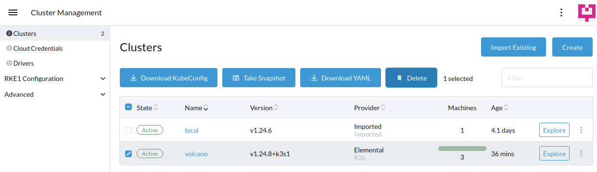
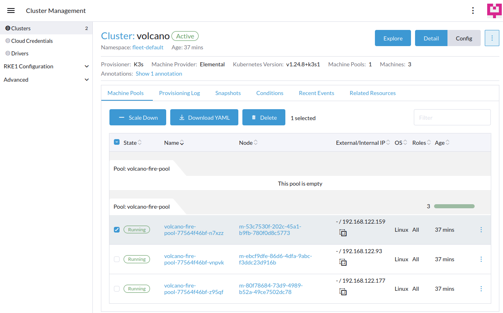

<head>
  <link rel="canonical" href="https://elemental.docs.rancher.com/reset"/>
</head>

## Machine Reset

There are two ways to reset Elemental machines to their original state or decommission them:

1. When deleting a Cluster, all associated machines will be reset  



2. When managing a Cluster, simply delete the Node that needs to be reset  



### Reset workflow

Once the related `MachineInventory` is flagged for deletion, a reset plan will be executed by the `elemental-system-agent` running on the machine.  

If the machine is still running, this plan will:

1. Reboot the machine in recovery mode.
2. Execute `systemctl start elemental-register-reset`.  
   This will fetch the remote `MachineRegistration` and apply the `spec.config.elemental.reset` options to reset the machine.  
   A new `MachineInventory` will be created and the `spec.config.cloud-config` defined in the `MachineRegistration` will be applied again.  

Note that the `MachineRegistration` reference will **not** change, the machine will **not** be reinstalled, the `COS_PERSISTENT` and `COS_OEM` partition will be cleared by default if reset is `enabled`. For more information, you can consult the [Partition Table](installation#deployed-partition-table).  

Since the `cloud-config` is re-applied during the reset workflow, you can reset a machine to apply updates from the `MachineRegistration` definition, for example to rotate `users` credentials and authorized keys. It is strongly recommended to enable the `reset-oem` option, to avoid conflicts with previously configured cloud-configs.  

If you need to bind a machine to a different `MachineRegistration` and trigger a new full installation, you need to reprovision it again using a new image.  

### Enable machine reset

In order to allow machines to be reset automatically, the `spec.config.elemental.reset.enabled` flag of the `MachineRegistration` should be toggled.  
This is off by default, but once activated, all newly created `MachineInventory` will inherit this setting automatically.  
For example:

```yaml
apiVersion: elemental.cattle.io/v1beta1
kind: MachineRegistration
metadata:
  name: fire-nodes
  namespace: fleet-default
spec:
  config:
    elemental:
      reset:
        enabled: true
        reset-persistent: true
        reset-oem: true
        # These cloud-init configs will be created during reset and will persist on the system after
        config-urls: 
          - "https://my.cloud.init/reset-plan-1.yaml"
          - "https://my.cloud.init/reset-plan-2.yaml"
        # You can select a different image to run the reset.  
        # Note that this image will not be installed on the system.
        system-uri: "my.oci.registry/reset-image:latest"
        power-off: false
        reboot: true
```

It is also possible to enable reset at a `MachineInventory` level, for example in scenarios where some machines are physical and will benefit from an automatic reset, and some others are virtual and can simply be destroyed and reprovisioned as needed.  
In order to flag a single `MachineInventory` to allow reset, you can use the `elemental.cattle.io/resettable: true` annotation.  
For example:  

```yaml
apiVersion: elemental.cattle.io/v1beta1
kind: MachineInventory
metadata:
  annotations:
    elemental.cattle.io/resettable: "true"
```
