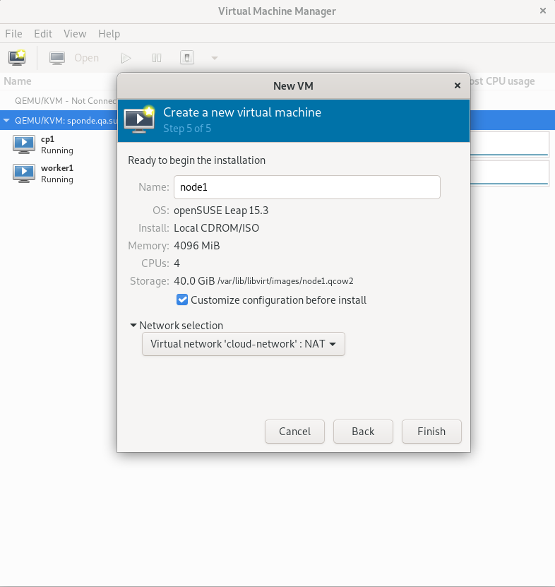
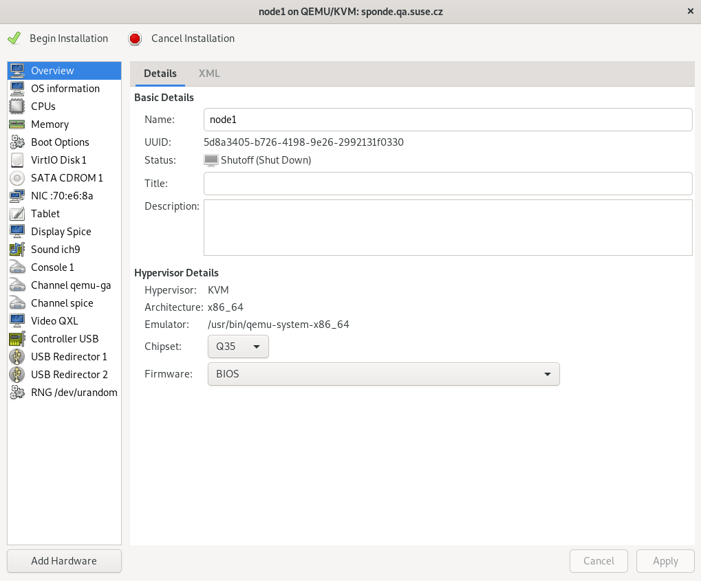
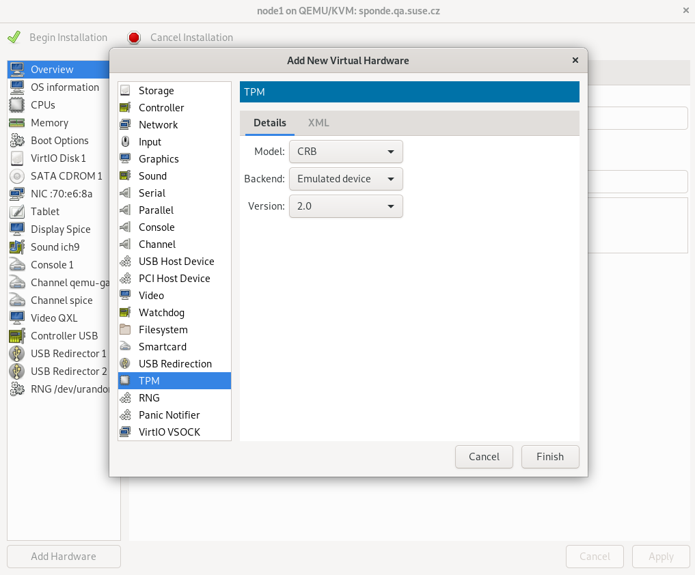

import RegistrationTpm from "!!raw-loader!@site/examples/quickstart/registration-tpm.yaml"

# Trusted Platform Module 2.0 (TPM)

Trusted Platform Module (TPM, also known as ISO/IEC 11889) is an international standard for a secure cryptoprocessor, a dedicated microcontroller designed to secure hardware through integrated cryptographic keys. The term can also refer to a chip conforming to the standard.

## Add TPM module to virtual machine

Easy way to add TPM to virtual machine is to use Libvirt with Virt-manager

### Create Virtual Machine

After starting virt-manager create new virtual machine

### Verify and edit hardware module list

On the hardware configuration screen, verify list of modules and click ***Add Hardware*** button

### Add TPM module to VM

From the list of emulated devices choose TPM module and add it to VM

### Finish VM configuration

On the last screen verify once again if TPM module was added properly

## Add TPM emulation to bare metal machine

During applying `#!yaml MachineRegistration` add following key to the yaml `config:elemental:registration:emulate-tpm: true`

:::info
If you plan to deploy more than 1 machine with TPM emulation, make sure to set `config:elemental:registration:emulated-tpm-seed: -1`
so the seed used for the TPM emulation is randomized per machine. Otherwise, you will get the same TPM Hash for all deployed machines and only the last
one to be registered will be valid.
:::

<CodeBlock language="yaml" title="registration-tpm.yaml" showLineNumbers>{RegistrationTpm}</CodeBlock>
