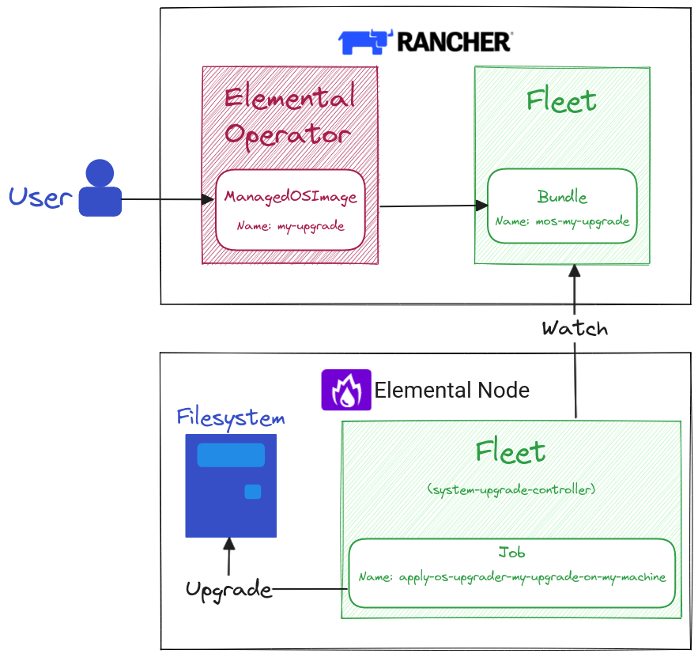

# Troubleshooting upgrade



For a high level overview of the upgrade workflow, please refer to the image above.  

## Rancher side

In this example we upgraded the cluster nodes with the following ManagedOSImage definition:

```yaml showLineNumbers
apiVersion: elemental.cattle.io/v1beta1
kind: ManagedOSImage
metadata:
  name: my-upgrade
  namespace: fleet-default
spec:
  # Set to the new Elemental version you would like to upgrade to or track the latest tag
  osImage: "registry.opensuse.org/isv/rancher/elemental/staging/teal53/15.4/rancher/elemental-teal/5.3:latest"
  clusterTargets:
    - clusterName: my-cluster
```

Once the `ManagedOSImage` is applied, the `elemental-operator` will verify it and generate a related `Bundle`.  
The `Bundle` name will be prefixed with `mos` and then the `ManagedOSImage` name. In this case `mos-my-upgrade`.  

In the `Bundle` definition, you will find the details about the upgrade plan and the desired target.  
For example:

```shell showLineNumbers
kubectl -n fleet-default get bundle mos-my-upgrade -o yaml
```

<details>
  <summary>Example</summary>

```yaml showLineNumbers
apiVersion: fleet.cattle.io/v1alpha1
kind: Bundle
metadata:
  creationTimestamp: "2023-06-16T09:01:47Z"
  generation: 1
  name: mos-my-upgrade
  namespace: fleet-default
  ownerReferences:
  - apiVersion: elemental.cattle.io/v1beta1
    controller: true
    kind: ManagedOSImage
    name: my-upgrade
    uid: e468ed21-23bb-487a-a022-dbc7ef753720
  resourceVersion: "1038645"
  uid: 35e83fc4-28c8-4b10-8059-cae6cdff2cda
spec:
  resources:
  - content: '{"kind":"ClusterRole","apiVersion":"rbac.authorization.k8s.io/v1","metadata":{"name":"os-upgrader-my-upgrade","creationTimestamp":null},"rules":[{"verbs":["update","get","list","watch","patch"],"apiGroups":[""],"resources":["nodes"]},{"verbs":["list"],"apiGroups":[""],"resources":["pods"]}]}'
    name: ClusterRole--os-upgrader-my-upgrade-296a3abf3451.yaml
  - content: '{"kind":"ClusterRoleBinding","apiVersion":"rbac.authorization.k8s.io/v1","metadata":{"name":"os-upgrader-my-upgrade","creationTimestamp":null},"subjects":[{"kind":"ServiceAccount","name":"os-upgrader-my-upgrade","namespace":"cattle-system"}],"roleRef":{"apiGroup":"rbac.authorization.k8s.io","kind":"ClusterRole","name":"os-upgrader-my-upgrade"}}'
    name: ClusterRoleBinding--os-upgrader-my-upgrade-f63eaecde935.yaml
  - content: '{"kind":"ServiceAccount","apiVersion":"v1","metadata":{"name":"os-upgrader-my-upgrade","namespace":"cattle-system","creationTimestamp":null}}'
    name: ServiceAccount-cattle-system-os-upgrader-my-upgrade-ce93d-01096.yaml
  - content: '{"kind":"Secret","apiVersion":"v1","metadata":{"name":"os-upgrader-my-upgrade","namespace":"cattle-system","creationTimestamp":null},"data":{"cloud-config":""}}'
    name: Secret-cattle-system-os-upgrader-my-upgrade-a997ee6a67ef.yaml
  - content: '{"kind":"Plan","apiVersion":"upgrade.cattle.io/v1","metadata":{"name":"os-upgrader-my-upgrade","namespace":"cattle-system","creationTimestamp":null},"spec":{"concurrency":1,"nodeSelector":{},"serviceAccountName":"os-upgrader-my-upgrade","version":"latest","secrets":[{"name":"os-upgrader-my-upgrade","path":"/run/data"}],"tolerations":[{"operator":"Exists"}],"cordon":true,"upgrade":{"image":"registry.opensuse.org/isv/rancher/elemental/staging/teal53/15.4/rancher/elemental-teal/5.3","command":["/usr/sbin/suc-upgrade"]}},"status":{}}'
    name: Plan-cattle-system-os-upgrader-my-upgrade-273c2c09afca.yaml
  targets:
  - clusterName: my-cluster
.
.
.
```

</details>

## Elemental Cluster side

Any Elemental Teal node correctly registered and part of the target cluster will fetch the bundle and start applying it.  
This operation is performed by the Rancher's `system-upgrade-controller` running on the Elemental Cluster.  
To monitor the correct operation of this controller, you can read its logs:

```shell showLineNumbers
kubectl -n cattle-system logs deployment/system-upgrade-controller
```

If everything is correct, the `system-upgrade-controller` will create an upgrade job for each targeted machine.  
The job names will use the Plan name (`os-upgrader-my-upgrade`) and the target machine hostname (`my-host`) for easy discoverability.  
For example: `apply-os-upgrader-my-upgrade-on-my-host-7a25e`  
You can monitor these jobs with:

```shell showLineNumbers
kubectl -n cattle-system get jobs
```

Each job will use a `privileged: true` container with the Elemental Teal image specified in the `ManagedOSImage` definition. This container will try to upgrade the system and perform a reboot.  

If the job fails, you can check its status by examining the logs:

```shell showLineNumbers
kubectl -n cattle-system logs job.batch/apply-os-upgrader-my-upgrade-on-my-host-7a25e
```

:::info Two stages job process

Note that the upgrade process is performed in two stages.  
You will notice that the same job is ran twice and the first one ends with the `Uknown` Status and will not complete.  
**This is to be expected**, as Elemental Teal relies on the job to be ran again after the machine restarts, so that it can verify the new version was installed correctly.  
You will notice a second run of the job, this time completing correctly.

```shell showLineNumbers
kubectl -n cattle-system get jobs 
NAMESPACE       NAME                                            COMPLETIONS   DURATION   AGE
cattle-system   apply-os-upgrader-my-upgrade-on-my-host-0b392   1/1           2m34s      6m23s
cattle-system   apply-os-upgrader-my-upgrade-on-my-host-7a25e   0/1           6m23s      6m23s
```

```shell showLineNumbers
kubectl -n cattle-system get pods 
NAME                                            READY   STATUS      RESTARTS      AGE
apply-os-upgrader-my-upgrade-on-my-host-zbkrh   0/1     Completed   0             9m40s
apply-os-upgrader-my-upgrade-on-my-host-zvrff   0/1     Unknown     0             12m
```

:::
