import Cluster from "!!raw-loader!@site/examples/quickstart/cluster.yaml"
import Registration from "!!raw-loader!@site/examples/quickstart/registration.yaml"
import RegistrationRPi from "!!raw-loader!@site/examples/quickstart/rpi-registration.yaml"
import Selector from "!!raw-loader!@site/examples/quickstart/selector.yaml"
import Prereqs from './partials/_quickstart-prereqs.md'
import Operator from './partials/_elemental-operator-install.md'

# Elemental the visual way

This quickstart will show you how to deploy the Elemental plugin into an existing Rancher Manager instance.

Once installed, you'll be able to provision a new Elemental cluster based on RKE2 or K3s.

<Prereqs />

<Operator />

## Enable the Rancher Manager Extensions Support

In order to enable the Rancher Manager Extensions Support, you'll need to follow the steps below:

* Open a web browser, connect and login to your Rancher Manager instance
* Click on the top left menu `a` and click on `Extensions`

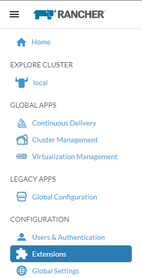

* Click on `Enable` button to install the `Extension Operator`

* A popup will appear, click on the `OK` button to continue and install the Rancher Manager Extensions repository

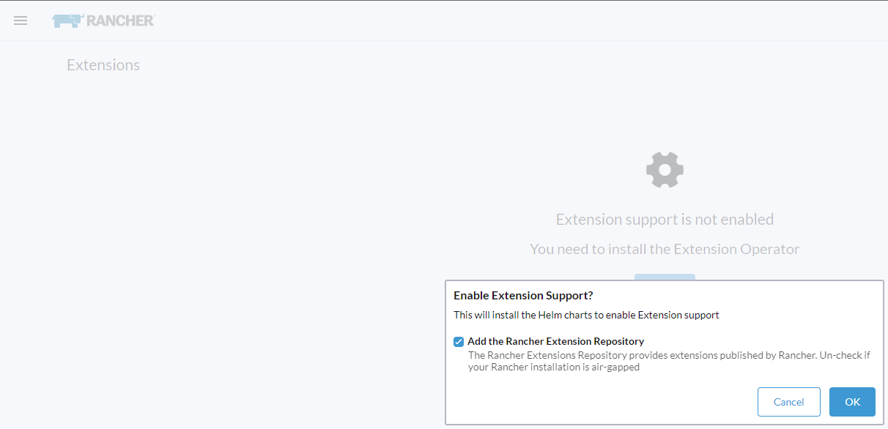

## Install the elemental plugin

After the Rancher Manager Extensions Support is enabled, you can install the `elemental` plugin as follow:

* Under the `Available` tab you will see `elemental` plugin available

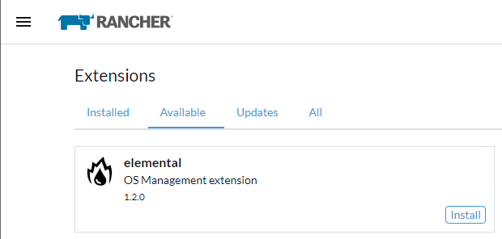

:::note
If the `Available` tab shows no entries, refresh the page. The `elemental` plugin will then appear.
:::

* Click on the `Install` button, a popup will appear and click on `Install` again to continue.

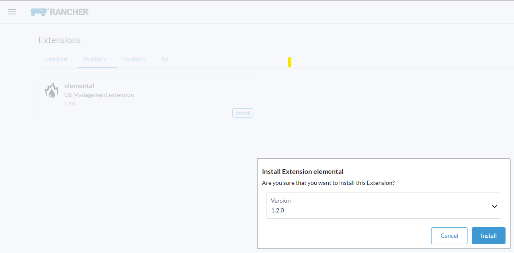

* On the `Installed` tab, the `elemental` plugin is now listed.

:::note
If the `elemental` plugin is listed and the status stays at `Installing...`, refresh the page. The `elemental` plugin will display correctly.
:::

Once the `elemental` plugin installed, you can see the `OS Manamagent` option in the Rancher Manager menu.

## Add a Machine Registration Endpoint

In the OS Management dashboard, click the `Create Registration Endpoint` button.

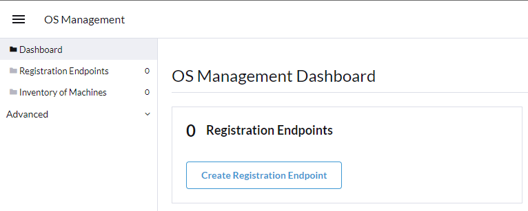

Now here either you can enter each detail in its respective places or you can edit this as YAML and create the endpoint in one go. Here we'll edit every fields.

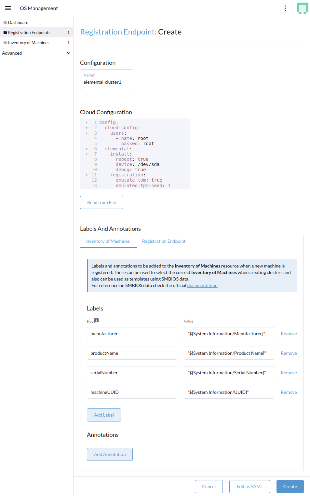

:::info main options
`name: elemental-cluster1`: change this as per your need

`device: /dev/sda`: make sure your target device is "sda". Otherwise find out how the disk device is named and change it here. For example, in Raspberry Pi it could be "mmblk"

`emulate-tpm: true`: use this only if your target device doesn't have a TPM device and you have a way of emulating TPM like in VMware or KVM

`emulated-tpm-seed: 1`: increase this by 1 for every new machine. If this value is not set, each machine will receive the same TPM hash and it won't show up under the machine inventory.
:::

:::danger attention
Emulated TPM is only for non-production usage like for testing as it beats the purpose of security. So in production usage use the code above without the `emulate-tpm` and `emulate-tpm-seed`
:::

Once you create the machine registration end point it should show up as active.

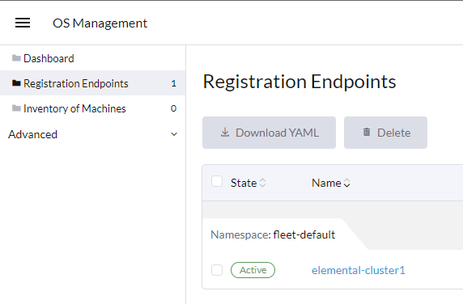

## Preparing the installation (seed) image

Now this is the last step, you need to prepare an Elemental Teal seed image that includes the initial registration config, so
it can be auto registered, installed and fully deployed as part of your cluster. The contents of the file are nothing 
more than the registration URL that the node needs to register and the proper server certificate, so it can connect securely.

This seed image can then be used to provision an infinite number of machines.

The seed image is created as a Kubernetes resource above and can be built using the `Build ISO` button:

Once the build is done, ISO can be downloaded using the `Download ISO` button:

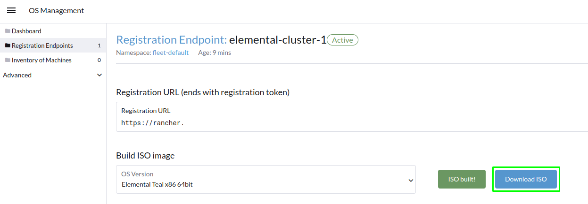

You can now boot your nodes with this image and they will:

- Register with the registrationURL given and create a per-machine `MachineInventory`
- Install Elemental Teal to the given device
- Reboot

## Machine Inventory

When nodes are booting up for the first time, they connect to Rancher Manager and a [`Machine Inventory`](https://elemental.docs.rancher.com/architecture#machineinventory) is created for each node.

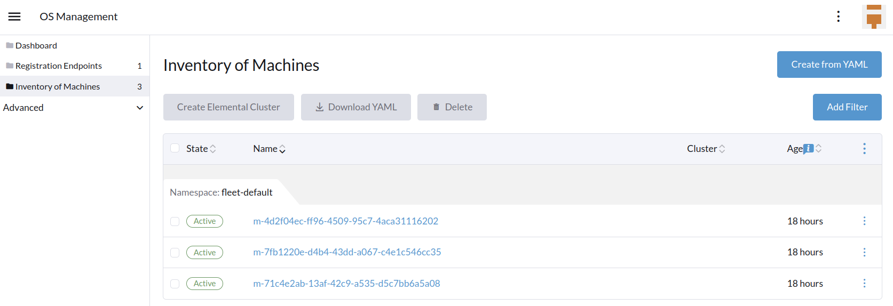

Custom columns are based on `Machine Inventory Labels` which you can add when you create your `Machine Registration Endpoint`:

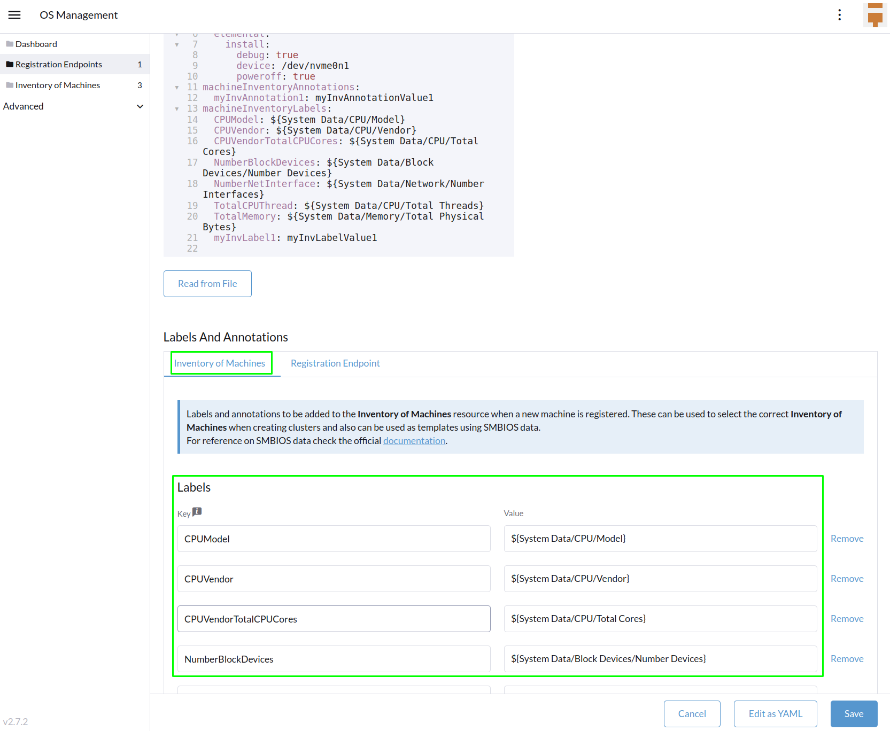

On the following screenshot, [`Hardware Labels`](https://elemental.docs.rancher.com/hardwarelabels/#hardware-labels) are used as custom columns:

You can also add custom columns by clicking on the three dots menu.

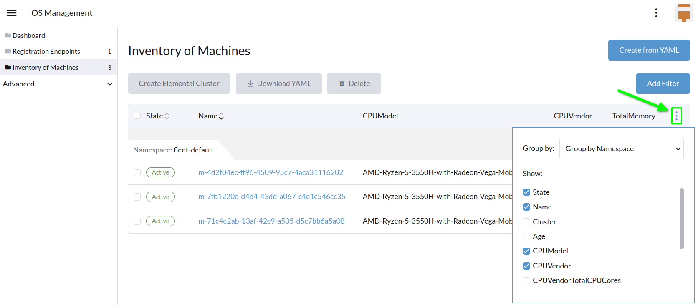

Finally, you can also filter your `Machine Inventory` using those labels.

For instance if you only want to see your AMD machines, you can filter on `CPUModel` like below:

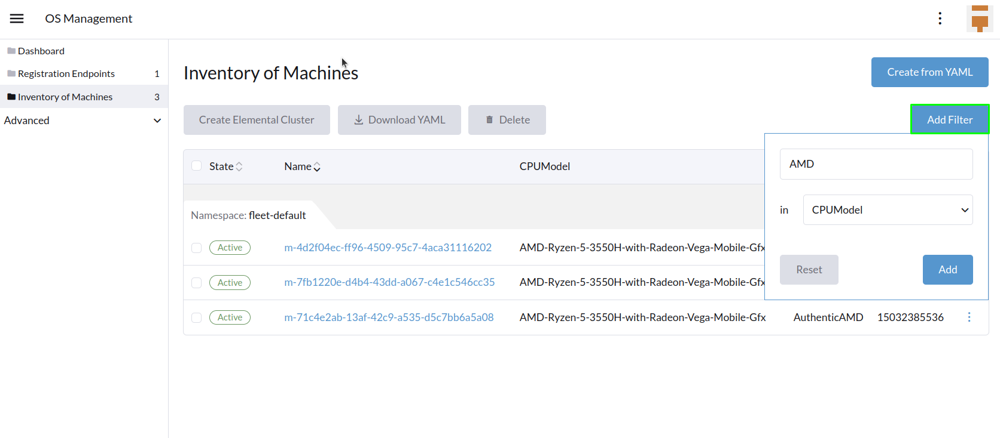

## Create your first Elemental Cluster

Now let's use those `Machine Inventory` to create a cluster by clicking on `Create Elemental Cluster` :

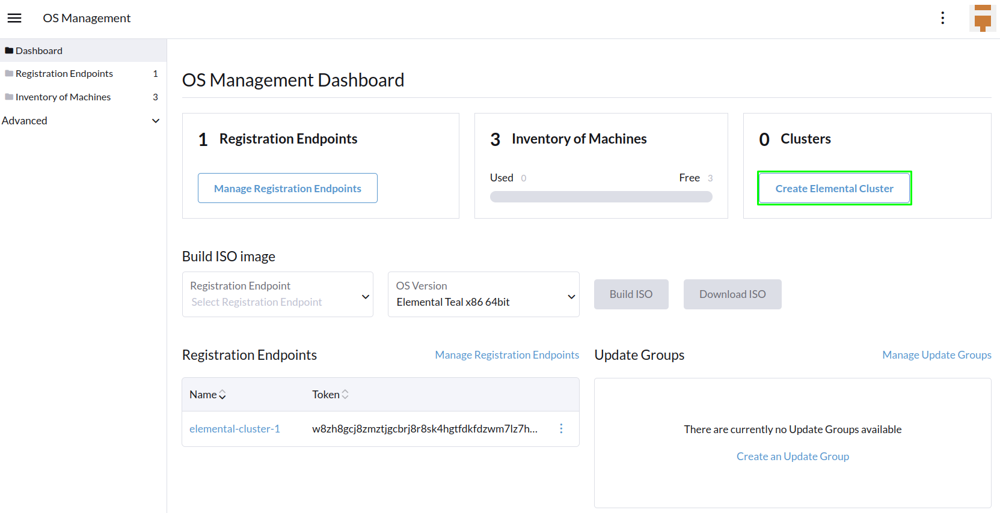

For your Elemental cluster, you can either choose K3s or RKE2 for Kubernetes.

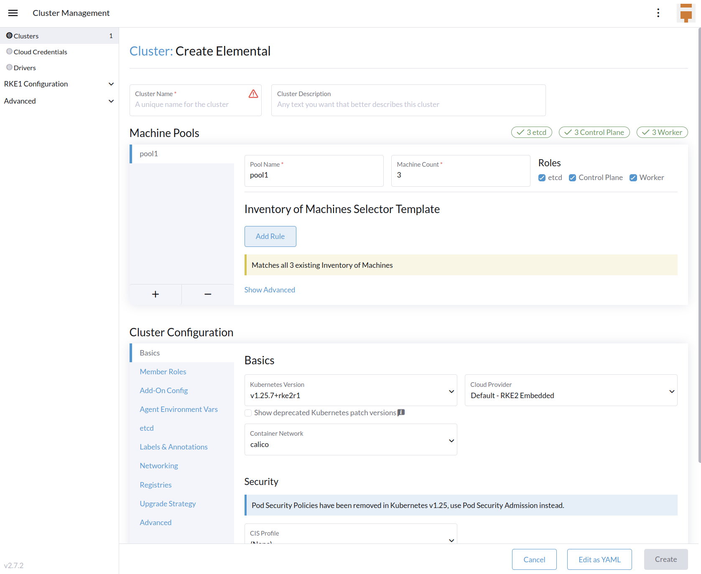

Most of the options are coming from Rancher, that's why we will not detail all the possibilities.
Feel free to check the [Rancher Manager documentation](https://ranchermanager.docs.rancher.com/pages-for-subheaders/rancher-server-configuration) if you want to know more.

However, it is important to highlight the `Inventory of Machines Selector Template` section.

It lets you choose which `Machine Inventory` you want to use to create your Elemental cluster using the previously defined `Machine Inventory Labels` :

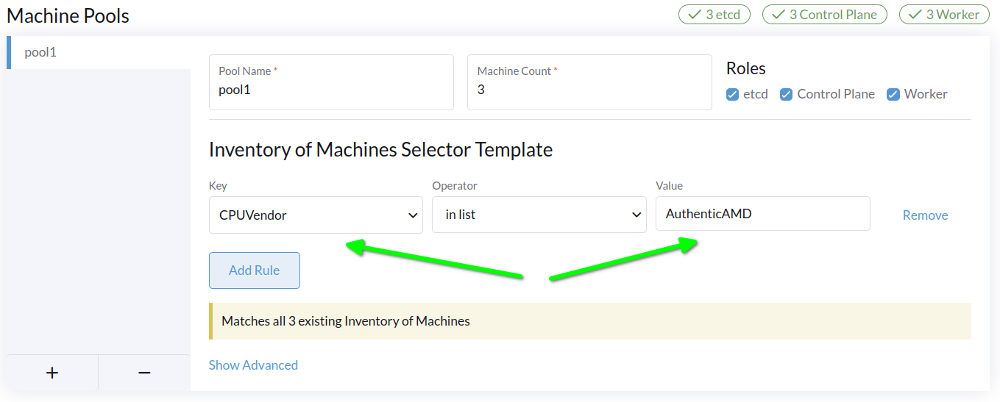

As our three Machine Inventories contain the label `CPUVendor` with the key `AuthenticAMD`, the three machines will be used to create the Elemental cluster.
