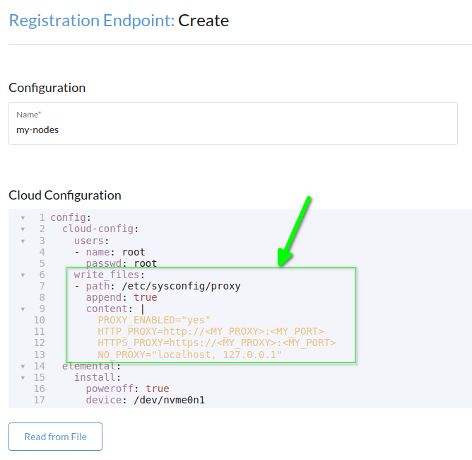
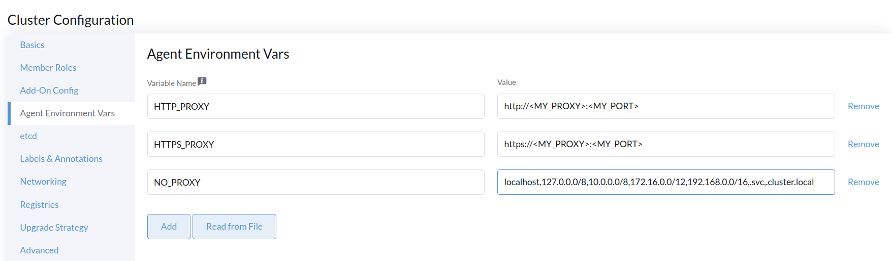

<head>
  <link rel="canonical" href="https://elemental.docs.rancher.com/elemental_behind_proxy"/>
</head>

import RegistrationProxy from "!!raw-loader!@site/examples/proxy/registration-proxy.yaml"
import SeedimageProxy from "!!raw-loader!@site/examples/proxy/seedimage-proxy.yaml"
import ClusterProxy from "!!raw-loader!@site/examples/proxy/cluster-proxy.yaml"

## Introduction

In a lot of enterprise environments, servers or VMs running on premises do not have direct Internet access. Instead, the connection to external services is done through a HTTP(S) proxy for security reasons. This tutorial shows you how to set up an Elemental deployment in such an environment.

:::caution important note
This guide will not cover the Rancher installation behind a proxy. It's a different use case and you can find the detailed documentation [here](https://ranchermanager.docs.rancher.com/pages-for-subheaders/rancher-behind-an-http-proxy).
:::

:::info info
For this documentation, we assume you are using a SUSE family system (like SLE Micro), so proxy settings have to be written in `/etc/sysconfig/proxy`.
:::

Proxy settings must be configured in the following locations:

- Machine Registration Endpoint
- SeedImage resource
- Elemental cluster configuration

The `elemental-system-agent` needs proxy settings to reach the Rancher Manager.
To achieve that, you need to fill the cloud-init section of the Machine Registration Endpoint.

You can do it either with [UI](quickstart-ui#add-a-machine-registration-endpoint) or [CLI](quickstart-cli#prepare-your-kubernetes-resources).

<Tabs>
<TabItem value="cliRegistration" label="CLI" default>
<CodeBlock language="yaml" title="registration.yaml" showLineNumbers>{RegistrationProxy}</CodeBlock>
</TabItem>
<TabItem value="uiRegistration" label="UI" default>


</TabItem>
</Tabs>

## Elemental-register

[Elemental-register](architecture-components#elemental-register-command-line-tool) is the first communication endpoint between the new host and Rancher Manager, this is the first place where proxy settings need to be set.

:::warning warning
At the time of writing, it's only possible to configure proxy settings for the ISO with the CLI. The proxy settings aren't implemented in the UI.
:::

The process happens when you boot your Elemental ISO for the first time, in order to configure the proxy settings you have to include a `cloud-init` definition in the ISO.
To do that, you have to create a [SeedImage](seedimage-reference) definition.

<CodeBlock language="yaml" title="seedimage.yaml" showLineNumbers>{SeedimageProxy}</CodeBlock>

Apply the YAML with `kubectl` and then, print your SeedImage definition to get the URL to download it:

```bash showLineNumbers
kubectl apply -f <my_seedimage_yaml_file>
kubectl get seedimage <seed_image_name> -n <namespace> -o yaml
```

Boot the ISO and you should see your new system appears in [Machine inventory](machineinventory-reference.md).

## Create Elemental cluster

For this step, you can use either the UI or CLI.

<Tabs>
<TabItem value="cliCluster" label="CLI" default>
<CodeBlock language="yaml" title="cluster.yaml" showLineNumbers>{ClusterProxy}</CodeBlock>
You can see that proxy settings are added below `agentEnvVars`.
</TabItem>
<TabItem value="uiCluster" label="UI" default>


</TabItem>
</Tabs>
