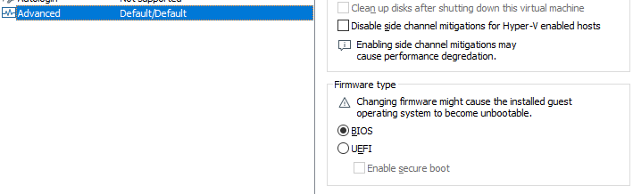
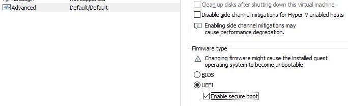
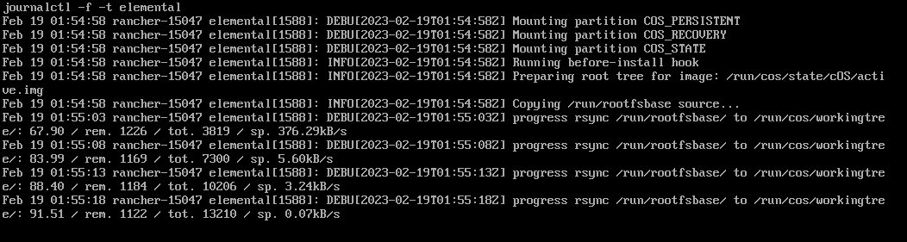

<head>
  <link rel="canonical" href="https://elemental.docs.rancher.com/rancher-vmware"/>
</head>

import Registration from "!!raw-loader!@site/examples/quickstart/registration.yaml"
import SeedImage from "!!raw-loader!@site/examples/quickstart/seedimage.yaml"

# How to use Elemental with Rancher and VMware

## Excerpt

In this document we will see how to set a virtual machine in VMware workstation to boot Elemental nodes.

## Prerequisites

1. Rancher 2.8 or higher installed and running. See the quick start guides.

## Step 1: Create the registration end point

We need to create an ISO image to bootstrap nodes and register against the Rancher instance. For that
a registration end point ([MachineRegistration](machineregistration-reference.md) resource) is required.

See this example of MachineRegistration:

<CodeBlock language="yaml" title="registration.yaml" showLineNumbers>{Registration}</CodeBlock>

The above MachineRegistration assumes the nodes include TPM 2.0. In case the virtualized target machine does
not include a virtual TPM device a software emulation can be configured in the
`config.elemental.registration` section.

Consider the following example:

```yaml showLineNumbers
apiVersion: elemental.cattle.io/v1beta1
kind: MachineRegistration
metadata:
  ...
spec:
  config:
    cloud-config:
      ...
    elemental:
      install:
        ...
      registration:
        emulate-tpm: true
        emulated-tpm-seed: -1
  machineInventoryLabels:
    ...
```

`emulated-tpm-seed: -1` sets the client to use a random seed to compute TPM hash, this is useful to be capable
to reuse the same registration end point definition for multiple machines. See further [TPM documentation](tpm.md).

## Step 2: Create the installation ISO

The installation media needs to be tied to a specific registration end point. This is created and handled
with the [SeedImage](seedimage-reference.md) resource.

Consider the following example:

<CodeBlock language="yaml" title="seedimage.yaml" showLineNumbers>{SeedImage}</CodeBlock>

Once the SeedImage resource is created it starts building an ISO with the provided OS image and linking it to
the given registration end point. Once done a download URL will be available in the SeedImage resource status.

You can download it with:

```shell
wget --no-check-certificate --content-disposition $(kubectl get seedimages.elemental.cattle.io -n fleet-default fire-img -o jsonpath="{.status.downloadURL}")
```

## Step 3: Boot the target device

Now ideally you would just burn the iso to a usb drive and boot your edge device using the usb device and once it boots and become active in Rancher under machine inventory you can select and create a cluster from it, however here we will use a vm to mimic an edge device for testing.

### 3.1 Prepare the VM to emulate TPM

In VMware workstation create a vm the way you would do normally, make sure to give the HDD size at least 40 GB.

Now edit the machine settings and go to the "Options" tab. The very last option would be "Advanced".

Click on "advanced" and on the right window pane change the firmware type from "BIOS" to "UEFI" and check the "Enable secure boot" option as follow:

* Default settings with BIOS selected



* Updated settings with UEFI selected and secure boot enabled



Now on the same "Options" tab click on the "Access Control" option and click on "Encrypt" on the right side.


This will ask you to enter a password to encrypt the machine. Enter a password and click on "Encrypt"

  

This is important to add the TPM Hardware. Next go back to the Hardware options and click on "Add"

And add the TPM (Trusted Platform Module) hardware and click on "Finish"

Now with the completion of this step our VM is ready.

### 3.2 Boot the VM with the elemental ISO

Next add the ISO that we created earlier in the VM and boot it up.

It should boot up with the ISO and start installing Elemental:




And once it is complete it will reboot the VM and it will show up as active under the machine inventory in Rancher.

