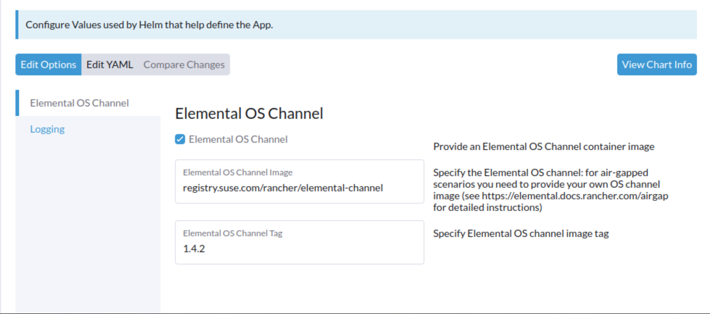

<head>
  <link rel="canonical" href="https://elemental.docs.rancher.com/airgap"/>
</head>

## Install Elemental in an Air-Gapped Environment

### Assumptions
A Rancher air-gapped installation should be already configured as per the [official Rancher documentation](https://ranchermanager.docs.rancher.com/pages-for-subheaders/air-gapped-helm-cli-install).
In particular, a private registry should be available in the air-gapped infrastructure.

### Overview
In order to run Elemental in an air-gapped environment the following artifacts are needed:
- the Elemental Operator charts
- the container images referenced in the charts (the *elemental-operator* and *seedimage-builder* images)
- the containerized OS images

Moreover, it could be handy to create a *channel image* referencing the containerized OS images available.
The official channel image (the *elemental-channel* one) references absolute URLs of the OS images on the official suse registry, so it cannot be used as-is in an air-gapped scenario.

### Elemental Air-Gapped installation from the command line
All the required steps can be accomplished by executing the
[`elemental-airgap.sh` script](https://raw.githubusercontent.com/rancher/elemental-operator/main/scripts/elemental-airgap.sh)
from a host with Internet access.

The Elemental charts are a required parameter to the script and can be provided as downloaded archives, URLs or as one of
the `stable`, `staging` and `dev` keywords, to let the script retrieve the correct chart version for you.

`elemental-airgap.sh` inspects the Elemental Operator chart, identifies all the required container images, downloads and saves them in a single docker archive.
It also builds a new OS channel image with the OS image URLs pointing to the private registry passed as argument
(which is a mandatory argument too).

The latest version of the elemental script can be easily downloaded from the official github repo:
```shell showLineNumbers
wget https://raw.githubusercontent.com/rancher/elemental-operator/main/scripts/elemental-airgap.sh
chmod 755 elemental-airgap.sh
```

Let's now download all the artifacts and build a custom channel from the latest stable release of Elemental:

<Tabs>
<TabItem value="dockerArchive" label="Create a Docker archive" default>

```shell showLineNumbers
./elemental-airgap.sh stable -r <REGISTRY.YOURDOMAIN.COM:PORT>
```

once completed (the script may take a while) the following files will be available in the current dir:
- `elemental-operator-crds-chart-<*VERSION*>.tgz`
- `elemental-operator-chart-<*VERSION*>.tgz`
- `elemental-images.txt`
- `elemental-images.tar.gz`

</TabItem>
<TabItem value="haulerArchive" label="Create a Hauler archive" default>

```shell showLineNumbers
./elemental-airgap.sh -ha stable -r <REGISTRY.YOURDOMAIN.COM:PORT>
```
once completed (the script may take a while) both the charts and the container images will be packed in the
hauler archive named `elemental-haul.tar.zst` .

</TabItem>
</Tabs>

#### Elemental installation
The files and archives created by the script should be copied to a host which:
- Has access to the private registry.
- Has the kubectl binary installed and configured to access the air-gapped Rancher cluster.
- Has the helm binary installed.


<Tabs>
<TabItem value="dockerArchive" label="Install from a Docker archive" default>

If the private registry requires authentication you need to log with docker into it:
```shellnocolor showLineNumbers
docker login <REGISTRY.YOURDOMAIN.COM:PORT>
```
Two steps are needed to perform the Elemental installation:
1. load the archive with all the required container images on the private registry:
this could be done using the `rancher-load-images.sh` script distributed with the Rancher release and already used for the Rancher air-gapped deployment:
```shellnocolor showLineNumbers
rancher-load-images.sh \
   --image-list elemental-images.txt \
   --images elemental-images.tar.gz \
   --registry <REGISTRY.YOURDOMAIN.COM:PORT>
```
2. install the downloaded elemental charts configuring the local registry and the newly created channel:
```shellnocolor showLineNumbers
helm upgrade --create-namespace -n cattle-elemental-system \
  --install elemental-operator-crds elemental-operator-crds-chart-<VERSION>.tgz

helm upgrade --create-namespace -n cattle-elemental-system \
  --install elemental-operator elemental-operator-chart-<VERSION>.tgz \
  --set registryUrl=<REGISTRY.YOURDOMAIN.COM:PORT> \
  --set channel.repository=rancher/elemental-channel-<REGISTRY.YOURDOMAIN.COM>
```
</TabItem>
<TabItem value="haulerArchive" label="Install from a Hauler archive" default>
To install from a [Hauler](https://rancherfederal.github.io/hauler-docs/) archive (`-ha` option in `elemental-airgap.sh`)
Hauler installation is also a requirement on the host from where the installation is performed.

If the private registry requires authentication you need to log with Hauler into it:
```shellnocolor showLineNumbers
hauler login <REGISTRY.YOURDOMAIN.COM:PORT> -u $USERNAME -p $PASSWORD
```

Three steps are needed to perform the Elemental installation:
1. Load the 'elemental-haul.tar.zst' Haul archive in the Hauler instance in the airgapped infrastructure:
```shellnocolor
hauler store load 'elemental-haul.tar.zst'
```
2. If the local registry in the air-gapped environment is not server by Hauler,
load the Haul archive in the local registry:
```shellnocolor
hauler store copy registry://<REGISTRY.YOURDOMAIN.COM:PORT>
```
:::info Hauler can also serve as a registry
In case the air-gapped local registry is served by an Hauler instance, just load the Haul archive directly there
(as shown in step (1)) and skip step (2).
:::

3. Extract the elemental charts from the Hauler store and install them:
```shellnocolor
hauler store extract elemental-operator-crds-chart-<ELEMENTAL-VERSION>.tgz

hauler store extract elemental-operator-chart-<ELEMENTAL-VERSION>.tgz

helm upgrade --create-namespace -n cattle-elemental-system \
  --install elemental-operator-crds elemental-operator-crds-chart-<ELEMENTAL-VERSION>.tgz

helm upgrade --create-namespace -n cattle-elemental-system \
  --install elemental-operator elemental-operator-chart-<ELEMENTAL-VERSION>.tgz \
  --set registryUrl=<REGISTRY.YOURDOMAIN.COM:PORT> \
  --set channel.repository=rancher/elemental-channel-<REGISTRY.YOURDOMAIN.COM:PORT>
```
</TabItem>
</Tabs>

:::info The elemental airgap script outputs the required commands
The `elemental-airgap.sh` scripts prints out the required commands shown above but using the actual chart version and the provided registry URL to allow to easily copy and paste the exact commands.
:::

### Elemental Air-Gapped installation from the Rancher Marketplace
A Rancher air-gapped installation includes also the Elemental Operator charts and the operator and seedimage container
images.

To collect the missing OS images and to build an OS channel image for your private registry execute the
[`elemental-airgap.sh` script](https://raw.githubusercontent.com/rancher/elemental-operator/main/scripts/elemental-airgap.sh)
from an host with Internet access, using the `-co` option.

As an example, let's target the `elemental-channel` image from the latest stable release of Elemental.
The script will take care of downloading the Elemental operator chart (if needed), extract the OS channel image URL,
download it, inspect all the OS images referenced, download all of them and create a new OS channel with links to the
private registry of the air-gapped scenario.
<Tabs>
<TabItem value="dockerArchive" label="Create a Docker archive" default>
```shell showLineNumbers
wget https://raw.githubusercontent.com/rancher/elemental-operator/main/scripts/elemental-airgap.sh
chmod 755 elemental-airgap.sh
./elemental-airgap.sh stable -co -r <REGISTRY.YOURDOMAIN.COM:PORT>
```
once completed (the script may take a while) the following files will be available in the current dir:
- `elemental-operator-crds-chart-<*VERSION*>.tgz`
- `elemental-operator-chart-<*VERSION*>.tgz`
- `elemental-images.txt`
- `elemental-images.tar.gz`
</TabItem>
<TabItem value="haulerArchive" label="Create a Hauler archive" default>
```shell showLineNumbers
./elemental-airgap.sh -ha -co stable -r <REGISTRY.YOURDOMAIN.COM:PORT>
```
once completed (the script may take a while) the container images will be packed in the
hauler archive named `elemental-haul.tar.zst`.
</TabItem>
</Tabs>

#### Elemental installation
The generated archive should be loaded to the air-gapped private registry.

<Tabs>
<TabItem value="dockerArchive" label="Install from a Docker archive" default>

If the private registry requires authentication you need to log with docker into it:
```shellnocolor showLineNumbers
docker login <REGISTRY.YOURDOMAIN.COM:PORT>

The script will print out the commands required to load the images via the Rancher `rancher-load-images.sh` tool, used
for the Rancher air-gapped installations. It should be something like:

```shell showLineNumbers
NEXT STEPS:

1) Load the 'elemental-images.tar.gz' to the local registry (<REGISTRY.YOURDOMAIN.COM:PORT>)
   available in the airgapped infrastructure:

./rancher-load-images.sh \
   --image-list elemental-images.txt \
   --images elemental-images.tar.gz \
   --registry <REGISTRY.YOURDOMAIN.COM:PORT>
```
Once the OS and channel images are loaded, you should skip the point (2) from the script output
(which will install the Elemental charts from the downloaded archives)
and instead perform the Elemental Operator installation from the Rancher UI.
</TabItem>
<TabItem value="haulerArchive" label="Install from a Hauler archive" default>
If the private registry requires authentication you need to log with Hauler into it:
```shellnocolor showLineNumbers
hauler login <REGISTRY.YOURDOMAIN.COM:PORT> -u $USERNAME -p $PASSWORD
```

The script will print out the commands required to load the images. It should be something like:

```shell showLineNumbers
NEXT STEPS:

1. Load the 'elemental-haul.tar.zst' Haul archive in the Hauler instance in the airgapped infrastructure:

hauler store load 'elemental-haul.tar.zst'

2. If the local registry in the air-gapped environment is not server by Hauler,
load the Haul archive in the local registry:

hauler store copy registry://<REGISTRY.YOURDOMAIN.COM:PORT>
```
Once the OS and channel images are loaded, you should skip the point (3) from the script output
(which will install the Elemental charts from the downloaded archives)
and instead perform the Elemental Operator installation from the Rancher UI.
</TabItem>
</Tabs>

When requested, put the full path of the OS channel image just uploaded in your private registry:


### Elemental UI Extension
Rancher 2.7.x doesn't support UI extensions plugin in air-gapped environments, and so the Elemental UI is not available in Rancher 2.7.x.

The Elemental UI plugin will be present in the available UI extensions in Rancher 2.8.0.
