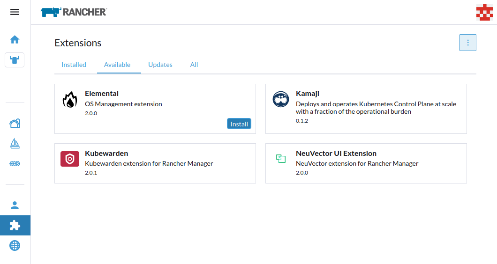
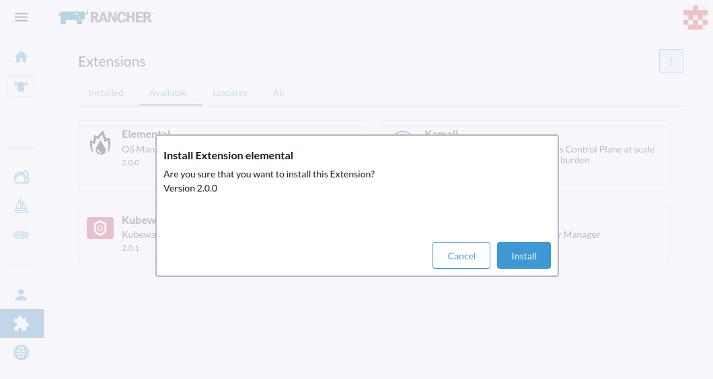
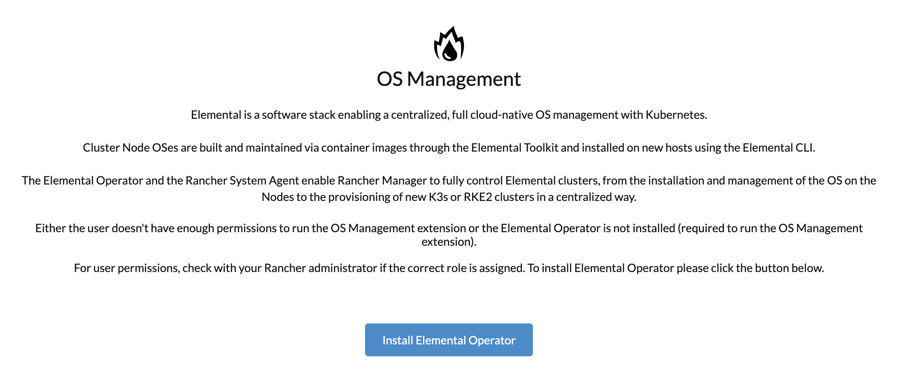

<head>
  <link rel="canonical" href="https://elemental.docs.rancher.com/quickstart-ui"/>
</head>

import Cluster from "!!raw-loader!@site/examples/quickstart/cluster.yaml"
import Registration from "!!raw-loader!@site/examples/quickstart/registration.yaml"
import RegistrationRPi from "!!raw-loader!@site/examples/quickstart/rpi-registration.yaml"
import Selector from "!!raw-loader!@site/examples/quickstart/selector.yaml"

# Elemental the visual way

:::note
The following instructions need Rancher 2.9.x at least.  
:::

This quickstart will show you how to deploy the Elemental plugin and operator into an existing Rancher Manager instance.

Once installed, you'll be able to provision a new Elemental cluster based on RKE2 or K3s.

However, if you want to install staging or dev operator, you can only do it in [CLI mode](quickstart-cli#non-stable-installations).

## Add the Official Rancher Extensions Repository

If the Elemental extension is not available, you need to add the `Official Rancher Extensions Repository`:


If this repository can not be added through the Extensions UI settings, it can be manually managed by [adding](https://ranchermanager.docs.rancher.com/how-to-guides/new-user-guides/helm-charts-in-rancher#manage-repositories) the `https://github.com/rancher/ui-plugin-charts` `git` repository, or alternatively by applying the following resource:  

```yaml
apiVersion: catalog.cattle.io/v1
kind: ClusterRepo
metadata:
  name: rancher-ui-charts
spec:
  gitBranch: main
  gitRepo: https://github.com/rancher/ui-plugin-charts
```

## Install the elemental plugin

After the Rancher Manager Extensions Support is enabled, you can install the `elemental` plugin as follow:

* Under the `Available` tab you will see `elemental` plugin available



:::note
If the `Available` tab shows no entries, refresh the page. The `elemental` plugin will then appear.
:::

* Click on the `Install` button, a popup will appear and click on `Install` again to continue.



* On the `Installed` tab, the `elemental` plugin is now listed.

:::note
If the `elemental` plugin is listed and the status stays at `Installing...`, refresh the page. The `elemental` plugin will display correctly.
:::

Once the `elemental` plugin installed, you can see the `OS Management` option in the Rancher Manager menu, refresh the page if you do not see it.


## Install the elemental operator

:::note
The following guide will show you how to install the operator through the Elemental UI. But you can also install it directly from the Marketplace.
:::

Click on the OS Management button in the navigation menu.

If the operator is not already installed, the elemental ui will let you deploy it by clicking on the `Install Elemental Operator` button:


It will redirect you to the Rancher Marketplace to install the operator.

Click on the `Next` button:


In this screen, you can customize or use the default values, click on `Install` to continue:


You should see `elemental-operator-crds`and `elemental-operator` deployed in the `cattle-elemental-system` namespace:


:::warning
If you do not see them, make sure to select the correct namespace at the top of the page.
:::

## Add a Machine Registration Endpoint

In the OS Management dashboard, click the `Create Registration Endpoint` button.


Now here either you can enter each detail in its respective places or you can edit this as YAML and create the endpoint in one go. Here we'll edit every fields.


:::info main options
`name: elemental-cluster1`: change this as per your need

`device-selector`: The [device-selector](machineregistration-reference#configelementalinstalldevice-selector) field can be used to dynamically pick device during installation. The field contains a list of rules to select the device you want.

`snapshotter`: Type of device used to manage snapshots in OS images.
:::

Once you create the machine registration end point it should show up as active.


## Preparing the installation (seed) image

Now this is the last step, you need to prepare a seed image that includes the initial registration config, so
it can be auto registered, installed and fully deployed as part of your cluster. The contents of the file are nothing
more than the registration URL that the node needs to register and the proper server certificate, so it can connect securely.

This seed image can then be used to provision an infinite number of machines.

The seed image is created as a Kubernetes resource above and can be built using the `Build Media` button, but first, you have to select ISO or RAW image.

In opposite to ISO where it needs two devices (device with ISO and another disk where to install Elemental), RAW image allows to boot from a single device and directly install the operating system in the device.
RAW image only contains a boot and a recovery partition and it boots first into recovery mode to install Elemental (for information, the process is similar to the [reset](reset#reset-workflow) one).


Once the build is done, media can be downloaded using the `Download Media` button:


You can now boot your nodes with this image and they will:

- Register with the registrationURL given and create a per-machine `MachineInventory`
- Install SLE Micro to the given device
- Reboot

## Machine Inventory

When nodes are booting up for the first time, they connect to Rancher Manager and a [`Machine Inventory`](machineinventory-reference.md) is created for each node.


Custom columns are based on `Machine Inventory Labels` which you can add when you create your `Machine Registration Endpoint`:


On the following screenshot, [`Hardware Labels`](hardwarelabels#hardware-labels) are used as custom columns:

You can also add custom columns by clicking on the three dots menu.


Finally, you can also filter your `Machine Inventory` using those labels.

For instance if you only want to see your AMD machines, you can filter on `CPUModel` like below:


## Create your first Elemental Cluster

Now let's use those `Machine Inventory` to create a cluster by clicking on `Create Elemental Cluster` :


For your Elemental cluster, you can either choose K3s or RKE2 for Kubernetes.


Most of the options are coming from Rancher, that's why we will not detail all the possibilities.
Feel free to check the [Rancher Manager documentation](https://ranchermanager.docs.rancher.com/pages-for-subheaders/rancher-server-configuration) if you want to know more.

However, it is important to highlight the `Inventory of Machines Selector Template` section.

It lets you choose which `Machine Inventory` you want to use to create your Elemental cluster using the previously defined `Machine Inventory Labels` :


As our three Machine Inventories contain the label `CPUVendor` with the key `AuthenticAMD`, the three machines will be used to create the Elemental cluster.
